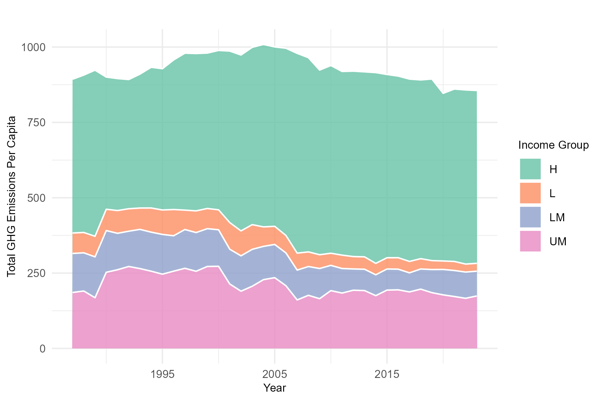

The aim of this project is to showcase the use of **SQL** and **Shiny** in RStudio, the former for data management and the latter for 
interactive visualizations. To deviate from usual financial topics, I decided to use publicly available data from the EDGAR (Emission Database for Gloabal Atmospheric Research)
on global emission and showcase some of their main findings. Specifically, I will focus on answering three topics:

- Comparison of GHG growth in the Euro Area, European Union (EU27) and globally
- Comparison of countries' GHG per capita emissions aggregated in income groups
- Contribution of individual countries and continents to global GHG emissions

### Workflow

To analyze greenhouse gas emissions, we begin by downloading the latest EDGAR (Emissions Database for Global Atmospheric Research) report. 
The dataset is available in CSV format and can be retrieved from the official EDGAR website.
Once downloaded, we load the data into an SQLite database to facilitate structured queries and efficient data retrieval. 
Below is the R code I used to achieve this:

```r
library(DBI)
library(RSQLite)


#SQL connection

db<- dbConnect(SQLite(), dbname="ghg_emissions.sqlite")

##Loop through sheets and add them to sql database

file <- "EDGAR_2024_GHG_booklet_2024.xlsx"
sheet_names <- excel_sheets(file)
sheet_names <- sheet_names[-(1:2)]

for (sheet in sheet_names){
  data <- read_excel(file, sheet=sheet)
  dbWriteTable(db, name = sheet, value =data, row.names = FALSE, overwrite=TRUE)
  }  
```

The code above does the following things. Using the **DBI** and **RSQlite** package, we first create a database with the fucntion **`dbConnect()`**. 
Once this database is created, we can create tables within this database using the function **`dbWriteTable()`**. In this case, since my .xlsx
file contains multiple sheets, I use a for loop to create tables for the different sheets. At the ened of this process we will have a
SQLite database called "ghg.emissions.sqlite", containing all the our data (note that the names of the talbes correspond to the names of
the sheet in the original .xlsx file). Now we can start to query!

In R we use the function **`dbGetQuery()`** to execute valid SQL queries through RSQLite. The function takes two inputs, the connection to the
Database and the query itself. The connection in our case is the object db that we created above, and the query can be any query that 
is valid for a SQLite database. Here is an example of a query useed to for the last part of this project: 


```r
db<- dbConnect(SQLite(), dbname="ghg_emissions.sqlite")

query <- paste0("
SELECT 
    Country,
    `EDGAR Country Code`,
    ", year_columns, "
FROM GHG_totals_by_country;
")

dataghg <- dbGetQuery(db, query)
```


In the code above I use the function paste0() to combine different strings into one coherent query, making the code more readable. The
resulting query is a rather simple one, selecting two columng (Country and EDGAR Country Code), form the table GHG-totals_by_country, only for 
the years that are included in the string "year-column". Once the query is made, we can simply pass it through the `dbGetQuery()` fucntion, 
making sure out connection to the database is establish, and obtain our desired dataframe. 

#### Integrating SQLite databases with dplyr

A very powerful application of SQLite database in R is its combinatoin with dplyr, the main data manipulation package in R. Combining the 
two allows using `dplyr` functions and pipe type syntax directly to the SQLite tables without the need for an actual query. For example


```r
library(dplyr)

ghg_ptr <- tbl(db, "GHG_totals_by_country")

selected_data <- ghg_ptr %>%
 select(Country, `EDGAR Country Code`, starts_with("20")) %>%  
  filter(Country == "Germany")  
```

First we create e pointer to the SQL database, without the need to loading the data. Then we can perform dplyr functions (like `select()`, `filter()`)
and the pype sintax to select our data. Not that the resulting object is not an in-memory dataframe or tibble, but rather a lazy table 
reference. If we want to collect it into a tibble, we can do that by using the function `collect()`.


###  Evolution of GHG Growth

Now lets get into the actual analysis of GHG emissions! First off we compare the evolution of global GHG emissions over the available timeseries
for three macro regions: Euro Area, EU27 and worldwide. The graph below shows the results. We can see that:

-  Emissions in the EU27 have steadily decreased over the past decades.
-  The euro area shows a similar trend but with smaller reductions.
-  Global emissions show a continued increase over the wole time horizon.




#### Dashboard with Shiny

To visualize the results of global emissions above I simply plotted a graph using the *`ggplot()`* function (Note that the code can be 
found in the github repository, link on top). Instead of plotting a static graph, I will next show how, using the *Shiny* package in R
to buiild interative we applications. The best workflow to create such an app is to create a script calles `app.R` that contains all
the components necessary for the shiny app. Specifically, a Shiny app needs three components: 

- a user interface object
- a server function
- a call to the `shinApp` funciton

The user interface (`ui`) as the name already says, contains all the instructions needed for the layout and appearance of the app. The
`server` function contains the actual output that the app contains (for example a line graph in our example), and the `shinyApp` function
combinge the UI and server instruction to create the app. 

For this example I will simply take the plot above and add some functionalities. Specifically I will allow for a choice between the 
macro regions as well as for simple or a cumulative time series. Note that in order to do so, we will need to create a dataframe (or tibble)
containing the necessary data to output these graphs such that we can reference it in the `server` function. The code for my example is 
the following:


```r
library(shiny) 

ui <- fluidPage(
  titlePanel(""),
  sidebarLayout(
    sidebarPanel(
      checkboxGroupInput(
        "selected_regions", 
        "Select Regions:", 
        choices = unique(shinydata$region), 
        selected = unique(shinydata$region)
      ),
      radioButtons(
        "time_series_type", 
        "Select Time Series Type:", 
        choices = c("Simple" = "ghg_emissions", "Cumulative" = "ghg_cumulative"), 
        selected = "ghg_emissions"
      )
    ),
    mainPanel(
      plotOutput("ghg_plot")
    )
  )
)

server <- function(input, output) {
  output$ghg_plot <- renderPlot({
    # Filter data based on user selection
    filtered_data <- shinydata %>%
      filter(region %in% input$selected_regions)
    
    # Create plot
    ggplot(filtered_data, aes(x = year, y = !!sym(input$time_series_type), color = region)) +
      geom_line(size = 1) +
      labs(
        title = "",
        x = "Year",
        y = ifelse(input$time_series_type == "ghg_emissions", "GHG Emissions", "Cumulative GHG Emissions"),
        color = "Region"
      ) +
      theme_minimal()
  })
}

shinyApp(ui = ui, server = server)

```

As you can see, we first define the layout and appearance option in our `ui()` function (e.g. the type of buttons used to choose the 
available options) whereas the `server()` function defines our outuput plot relative to the different input options. If we run 
the `shinyApp()` functions using our UI/Server pair we get the following: 


<iframe src="https://trizzzio.shinyapps.io/growthapp/" width="100%" height="750px" frameborder="0"></iframe>


### Comparison of GHG growth per capita for different income groups

Now that I covered all the main coding related concepts used in this project, lets focus on the last two points we wanted to cover 
using the emission data from the most recent EDGAR report. Next I will look at the the data of per capita emissions. Additionally I will use
the income groups defined by the World Bank as categories for aggregation. The stacked line graph below shows the result of this analysis.



The following observations can be made about the evolution of per capita GHG emissions aggregated by income classes: 

-  High-income countries have by far the highest per capita emissions.
-  The proportion of contributions by income class has remained fairly stable over the time horizon.
-  Global emissions have slightly decreased over the last couple of decades.


### Contribution to Total World GHG Emissions

Finally I will look at the contributions of single countries as well as continents to global emissions. In order to visualize this, 
I decided to use a treemap representation combined with a shiny app, allowing us to see the contributions throughout our timeframe.


<iframe src="https://trizzzio.shinyapps.io/contributionapp/" width="100%" height="800px" frameborder="0"></iframe>

We can see that China and the United States remain the largest emitters, with China seeing the biggest absolute increase in 2023. 
India’s emissions surged by 6.1%, marking the largest relative rise. Meanwhile, the European Union continued its steady decline, 
with emissions falling by 7.5%, reducing its global share to 6.1%. The most significant drops occurred in the power and industrial
sectors.

Despite international efforts, global GHG emissions hit a record 53.0 Gt CO2eq in 2023, up 1.9% from 2022. Fossil CO2 remains the 
dominant source, accounting for 73.7% of total emissions. As emerging economies expand their industrial activity, the challenge 
remains to balance growth with effective climate policies.

